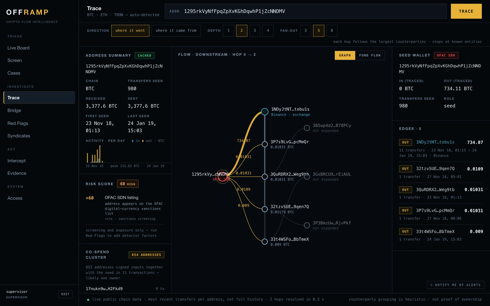
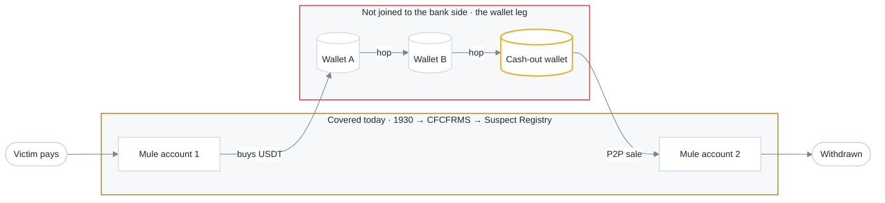
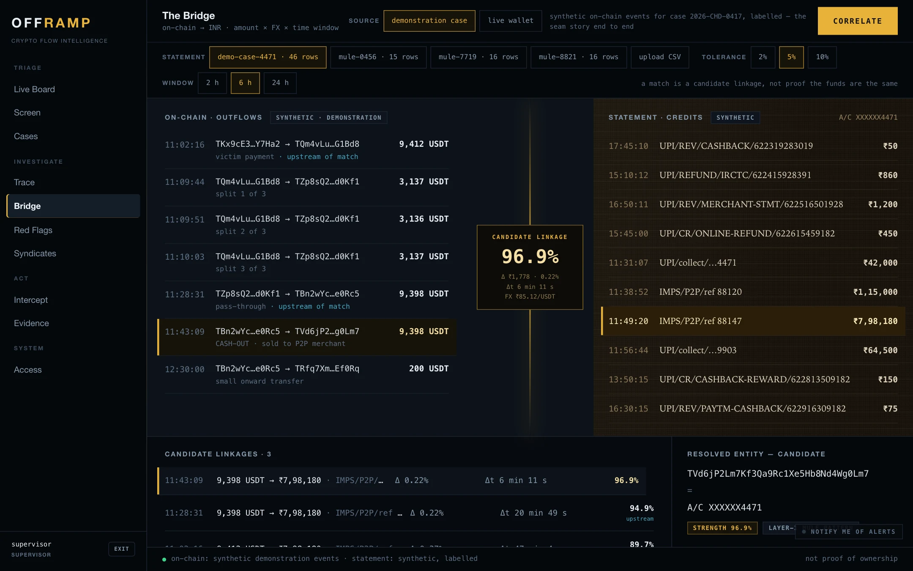
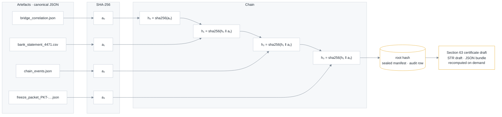
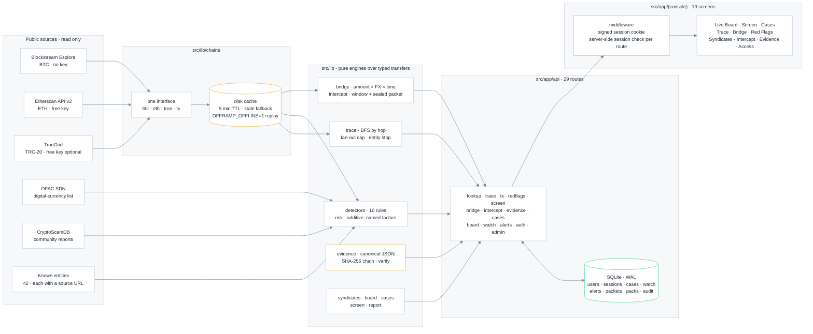

<p align="center">
  
</p>

<h3 align="center">Crypto-to-cash investigation console for cyber-crime units.<br>Trace the flow, join it to the bank credit, act inside the withdrawal window, seal the evidence.</h3>

<p align="center">
  
  
  
  
  
  
</p>

<p align="center">
  
  
  
  
  
</p>

<p align="center">
  <a href="#why-offramp">Why OFFRAMP</a> ·
  <a href="#demo-walkthrough">Demo walkthrough</a> ·
  <a href="#the-console">The console</a> ·
  <a href="#how-it-works">How it works</a> ·
  <a href="#architecture">Architecture</a> ·
  <a href="#data-and-what-is-synthetic">Data</a> ·
  <a href="#honest-limitations">Limitations</a> ·
  <a href="#future-scope">Future scope</a> ·
  <a href="#getting-started">Getting started</a>
</p>

A mule bank account can be frozen in minutes. The crypto leg in between is where the trail is hardest to connect to the bank side. **OFFRAMP** traces stolen funds across Bitcoin, Ethereum and TRON, screens every address on the path, matches the cash-out to the rupee credit that followed it, prepares the freeze request while the withdrawal window is still open, and seals the evidence so anyone can recompute it. Built on live public chain data, with clearly labelled synthetic demonstration data.

<p align="center"><b>Complaint → <a href="#demo-walkthrough">Trace</a> → <a href="#demo-walkthrough">Red Flags</a> → <a href="#demo-walkthrough">Bridge</a> → <a href="#demo-walkthrough">Intercept</a> → <a href="#demo-walkthrough">Evidence</a></b><br><sub>one case file · every step audited · every hash recomputable</sub></p>

<p align="center">
  
</p>
<p align="center"><sub><b>Trace</b> on a live OFAC-listed Bitcoin wallet, two hops downstream. The largest edge lands on a Binance deposit address whose label links to its public source. The risk score names its one factor. The co-spend cluster lists addresses that signed inputs together with the seed.</sub></p>

| | |
|---|---|
| **Trace** | multi-hop flow across BTC, ETH and TRON from public explorers, cached on disk, replayable offline |
| **Screen** | OFAC SDN digital-currency list, CryptoScamDB reports, 42 exchange and mixer labels with source URLs |
| **Detect** | ten rule-based indicators mapped to FATF red-flag categories, one transparent risk score; no model |
| **Correlate** | on-chain cash-out ↔ INR bank credit by amount, rate and time; complaints ↔ cash-out wallets into syndicates |
| **Act** | withdrawal window measured on the wallet, SHA-256 sealed freeze packet, supervisor sign-off, live board and alerts |
| **Preserve** | hash-chained evidence packs, STR draft, Section 63 certificate draft, investigation report, audit log |

---

## Why OFFRAMP

Stolen money follows one route: victim to mule account, mule account to USDT, two or three wallet hops, a P2P sale back into rupees, withdrawal. The money is crypto for about an hour.

The interception pipeline that exists today is built for the cash half. The 1930 helpline feeds CFCFRMS, banks freeze on request, and the I4C Suspect Registry holds 24.67 lakh mule accounts; the pipeline has saved ₹7,130 crore. It covers bank accounts, SIMs and IMEIs, not wallet addresses (Ministry of Home Affairs, Lok Sabha Unstarred Question No. 432, answered 02.12.2025). The wallet leg can be read on a public explorer, but nothing in the pipeline joins it to the bank credit on the other side.



### What makes it different from a block explorer

An explorer shows one address at a time and stops there. OFFRAMP keeps the whole case in one place and connects the steps an officer has to take:

- **Tracing with screening built in.** Every node on a multi-hop trace is checked against the sanctions list, the community-report index and the entity book as it is discovered, and the trace stops at known exchanges and mixers.
- **Detection that explains itself.** Ten rule-based indicators and a risk score whose every point names its rule and its evidence. No model, no opaque number.
- **The bank-side join.** The Bridge matches an on-chain cash-out to a rupee credit in a bank statement by amount, exchange rate and timing, and reports it as a candidate linkage with its rivals.
- **An action workflow, not a report.** A withdrawal window measured on the wallet's own behaviour, a freeze-request packet sealed with SHA-256, and a supervisor sign-off recorded as a separate step.
- **Evidence that survives scrutiny.** Every artefact is hashed and chained; the root hash, the draft STR, the Section 63 certificate draft and the investigation report all carry hashes that a third party can recompute.
- **The network view.** Complaints that cashed out through the same wallet are grouped into syndicates, so one case becomes an operator profile.

OFFRAMP does not freeze funds, does not transmit anything to a bank or exchange, and never names a wallet's owner without a public source.

---

## Demo walkthrough

The demonstration case `2026-CHD-0417` is an investment-app fraud that cashed out through a P2P merchant. Its narrative, wallets and bank statement are synthetic and labelled on every screen. Sign in as `investigator`, then follow the case in this order:

| Step | Screen | What to do | What you will see |
|---|---|---|---|
| 1 | **Trace** | Pick a verified demonstration wallet or paste any BTC, ETH or TRON address | Chain auto-detected, address screened, risk score with its factors, hop-by-hop flow graph that stops at known entities. Toggle *Fund flow* for the value-conserving view. |
| 2 | **Red Flags** | Run the detectors on the same wallet | Which of the ten indicators fired, the evidence lines and transaction ids behind each, and why the others cleared. |
| 3 | **Bridge** | Choose *demonstration case* and correlate with statement `demo-case-4471` | 9,398 USDT out at 11:43:09 beside ₹7,98,180 in at 11:49:20: Δ 0.22 % at ₹85.12/USDT, Δt 6 min 11 s, strength 96.9 %. Two weaker candidates listed beside it. |
| 4 | **Intercept** | Assess the window and seal the packet | How the window was derived (measured on the wallet, or the labelled 2-hour default), the trigger chain, the freeze-request packet and its SHA-256 on sealing. |
| 5 | **Live Board** | Sign in as `supervisor` and sign the packet off | The sign-off recorded as its own audited action; the open window counting down; watched addresses re-evaluated every 60 s. |
| 6 | **Evidence** | Assemble and seal the pack | Four artefacts hashed and chained to a root, the chain verified on demand, exports of the JSON bundle, STR draft and Section 63 certificate draft. |
| 7 | **Cases** | Open the case | Every step above on one timeline under the login that took it, and the printable investigation report with its body hash. |

Optional detours: **Screen** ranks a pasted list of up to 200 addresses; **Syndicates** groups the synthetic complaints dataset by shared cash-out wallet. Set `OFFRAMP_OFFLINE=1` to run the whole walkthrough from the disk cache with no network.

<p align="center">
  
</p>
<p align="center"><sub><b>Bridge.</b> Outflows on the left, statement credits on the right, the seam between them. The best candidate is highlighted with its deviation and lag; rivals are shown, not hidden.</sub></p>

---

## The console

| Module | What it does | Data |
|---|---|---|
| **Live Board** | Watched addresses re-evaluated against live chain state every 60 s. Activity feed from chain events and the audit log. Open freeze windows counting down. Five alert rules, each raised once per event. | live |
| **Screen** | Paste up to 200 addresses; each is checked against the SDN list, the report index, the entity book and live chain activity, then ranked by the same risk score. Watch the flagged ones in one click; export CSV. | live |
| **Cases** | Sequential case files on a seed wallet. One timeline of chain events, bank rows, packets, packs, alerts and officer actions. Search across everything the console holds. Printable investigation report with a body hash. | live · demo case labelled synthetic |
| **Trace** | Breadth-first flow by hop, following the largest counterparties, stopping at known entities. Graph and fund-flow views. Every node screened. Transaction-hash lookup with both sides screened. Bitcoin co-spend clusters by the common-input-ownership heuristic. | live |
| **Bridge** | On-chain cash-out matched to an INR bank credit by amount × rate × time. Candidate linkage with strength and rivals. Four sample statements plus CSV upload. | live events or synthetic statement |
| **Red Flags** | Ten rule-based indicators mapped to FATF red-flag categories. Each fires with evidence and transaction ids and a bounded confidence, or clears with the reason. | live |
| **Intercept** | Withdrawal window from the wallet's own inflow→outflow lag, otherwise a labelled policy default. Freeze-request packet sealed with SHA-256. Supervisor sign-off as a separate audited step. | live · demo replay |
| **Evidence** | Artefacts serialised canonically, hashed, chained to a root, verified on demand. Exports: JSON bundle, STR draft in FIU-IND layout, Section 63 certificate draft. | case artefacts |
| **Syndicates** | Complaints sharing a cash-out wallet, joined transitively into operator groups with loss, tempo, cities and rails. Hand-offs to Trace, Watch and Cases. | synthetic complaints, labelled |
| **Access** | Own account and sessions. Supervisor: provision, roles, disable, reset, access log. | live |

---

## How it works

Every number on a screen comes from a rule that can be read in this repository. Full definitions are in [docs/METHOD.md](docs/METHOD.md).

- **Detectors.** Ten rule-based indicators, each mapped to a FATF virtual-asset red-flag category (rapid layering, structuring, P2P off-ramp, velocity spike, mixer contact, sanctions hit, bridge hop, dormant reactivation, peel chain, round amounts). The FATF guidance names the behaviour; the thresholds and logic are this project's own and are stated per detector.
- **Risk score.** Additive weights, capped at 100, every point tied to a named rule and its evidence. The weights are transparent prioritisation heuristics, not probabilities and not statistically calibrated. The score ranks wallets for attention.
- **Bridge strength.** For each outflow and each later credit inside the window, amount agreement and time agreement are combined as a geometric mean. The result is a plausible candidate linkage. It does not prove that a bank credit came from a particular crypto transaction, and near-equal candidates are marked ambiguous.
- **Withdrawal window.** The median inflow→outflow lag on the wallet when three or more pairs exist (floored at 10 min, capped at 48 h); otherwise a 2-hour policy default, labelled as a planning figure.
- **Evidence chain.** Canonical JSON, SHA-256 per artefact, hashes chained to a root.



One altered byte changes the root. The Evidence screen recomputes the chain on demand and the certificate draft records whether the recomputation matched the sealed manifest. Anyone with a SHA-256 implementation can repeat it from the exported bundle. The STR and Section 63 documents are drafts populated from the case; they carry no effect until the persons the law requires sign them.

---

## Architecture

**Stack.** Next.js 16 (App Router) · React 19 · TypeScript 5 · Tailwind CSS 4 · better-sqlite3 · Node.js `crypto` for scrypt, HMAC and SHA-256. One codebase serves the console and its API. No Python service, no queue, no external model.



- **Chain adapters** for Bitcoin, Ethereum and TRON behind one interface; a fourth chain is one more adapter.
- **Disk cache** keyed by URL with a five-minute TTL, stale fallback when the network fails, and full offline replay.
- **Engines** are pure functions over typed transfers, so the same code runs on live data and on the demonstration set.
- **SQLite** in WAL mode through better-sqlite3 for users, sessions, cases, watch list, alerts, packets, packs and the audit log. The schema is plain SQL behind one module; a Postgres port would replace the driver, not the engines.
- **Access control.** No public sign-up; a supervisor provisions accounts. scrypt password hashes with per-user salts, HMAC-SHA-256 signed httpOnly session cookies, five failed logins lock an account for fifteen minutes, three roles with supervisor-only sign-off, case closing and account management enforced on the server. The edge middleware checks the cookie's signature and expiry; every API route then re-checks the server-side session record, so logout, *sign out everywhere* and disabling an account end API access immediately. Sessions expire after twelve hours.

### Project structure

```
OFFRAMP/
├── src/
│   ├── app/
│   │   ├── page.tsx                      landing · live money-flow wall
│   │   ├── login/                        sign-in
│   │   ├── (console)/                    ten authenticated screens
│   │   │   ├── live-board/  screen/  cases/
│   │   │   ├── trace/  (Sankey.tsx)  bridge/  red-flags/  syndicates/
│   │   │   └── intercept/  evidence/  access/
│   │   └── api/                          29 server routes
│   │       ├── lookup · trace · tx · cospend · redflags · screen · search
│   │       ├── bridge · statements · intercept/{seal,approve}
│   │       ├── evidence/{seal,[id]/export} · cases/[id]/report · syndicates
│   │       └── board · watch · alerts · auth/* · admin/users · addresses
│   ├── lib/
│   │   ├── chains/        btc.ts · eth.ts · tron.ts · tx.ts · one interface
│   │   ├── trace/         engine.ts (BFS by hop) · labels.ts (sourced entities)
│   │   ├── detectors/     ten rule-based indicators
│   │   ├── bridge/        parse.ts · fx.ts · correlate.ts · sample.ts
│   │   ├── intercept/     window estimate · canonical JSON · sealed packets
│   │   ├── evidence/      hash chain · manifest · verify
│   │   ├── syndicates/    transitive grouping by cash-out wallet
│   │   ├── board/         60 s re-evaluation · five alert rules
│   │   ├── cases/         unified timeline
│   │   ├── risk.ts        transparent score
│   │   ├── screen.ts      bulk screening
│   │   ├── report.ts      printable investigation report
│   │   ├── cache.ts       disk cache · stale fallback · offline replay
│   │   ├── auth.ts        scrypt · HMAC sessions · lockout
│   │   ├── db.ts          SQLite schema · seed · audit
│   │   └── ofac.ts · scam.ts · entities.ts · demo-graph.ts
│   ├── components/
│   │   ├── console/       shell, inputs, chips, previews
│   │   ├── landing/       Landing.tsx · NetGraph.tsx
│   │   └── AlertWatcher.tsx · Rail.tsx · Stub.tsx
│   ├── templates/         str.html · bsa63.html
│   └── middleware.ts      signature and expiry check on every non-public path
├── data/
│   ├── ofac/              XBT · ETH · TRX · USDT · meta (940 unique addresses)
│   ├── scam/              cryptoscamdb.json (4,270 reports)
│   ├── known-entities.json  42 exchanges and mixers, each with a source URL
│   ├── demo/addresses.json  verified demonstration address book
│   └── synthetic/         complaints.json · statements/*.csv, labelled
├── scripts/               sync-ofac · sync-scam-lists · gen-synthetic · gen-complaints · build-demo-addresses
├── docs/                  README assets, METHOD.md, ARCHITECTURE.md
└── .cache/                chain responses (untracked)
```

Design rationale, the access model in detail, case lifecycle and feature coverage are in [docs/ARCHITECTURE.md](docs/ARCHITECTURE.md).

---

## Data and what is synthetic

Nothing that solves the problem is outsourced. The trace engine, detectors, risk score, correlation, window estimate, hash chain, clustering and every screen are written in this repository. Third parties supply data reads and general-purpose libraries.

| Component | Role | Terms |
|---|---|---|
| [Blockstream Esplora](https://blockstream.info/api/) | Bitcoin address summaries and transactions | public, no key |
| [Etherscan API v2](https://docs.etherscan.io/) | Ethereum transaction lists and transactions by hash | free key, rate-limited |
| [TronGrid](https://www.trongrid.io/) | TRON accounts, TRC-20 (USDT) transfers, transactions by hash | free key raises limits |
| [OFAC SDN digital-currency addresses](https://github.com/0xB10C/ofac-sanctioned-digital-currency-addresses) (public mirror by 0xB10C) | sanctions screening, `data/ofac`, 940 unique addresses across the BTC, ETH, TRX and USDT lists, synced 2026-08-31 | public domain source data |
| [CryptoScamDB](https://cryptoscamdb.org/) | community-reported addresses, `data/scam`, 4,270 entries, shown as reports, not findings | open data |
| WalletExplorer, Etherscan and Tronscan labels; OFAC designations | known exchanges and mixers, `data/known-entities.json`, 42 entries, each with its source URL, each checked against that page (`data/known-entities-check.csv`) | public pages, cited per entry |
| Next.js, React, Tailwind CSS, better-sqlite3, TypeScript | framework, UI, styling, embedded database, typing | MIT |
| Node.js `crypto` (scrypt, HMAC, SHA-256) | password hashing, session signing, evidence hashing | standard library |
| Pre-trained models | none | |

No stolen credentials, private keys, wallet seeds or illicit funds are used or stored. The two API keys are free-tier keys kept in an untracked local file.

**Synthetic and labelled as such:** the demonstration case `2026-CHD-0417` (narrative, cash-out wallet `TVd6jP2Lm7Kf3Qa9Rc1Xe5Hb8Nd4Wg0Lm7`, seven on-chain events, statement `demo-case-4471.csv`); everything under `data/synthetic` (statements, complaints), none of which is a real on-chain identity; the Intercept replay clock; and the INR reference rates used when no rate table is present (₹85.12 per USDT and equivalents), labelled *fallback* wherever shown. Everything else is read live from public chains at the moment you look at it.

**What OFFRAMP does not do:** freeze, seize or move funds; transmit packets or reports (delivery states are workflow status); attribute ownership (a label means a public source documents it); or decide (detector output is presumptive, a Bridge match is a candidate).

---

## Honest limitations

- **Recent-window analysis.** Each lookup uses the most recent transactions an explorer returns in one call (about 25 on Bitcoin, 50 on Ethereum, 50 TRC-20 on TRON). Traces, detectors and the risk score work on that window and the Trace status bar says so; the address summary totals cover the full history.
- **Heuristics, not verdicts.** Detector confidences and risk weights are heuristics, a Bridge match is a candidate linkage, co-spend clustering is Bitcoin-only. None establishes ownership. The STR and Section 63 outputs are drafts populated from the case; they take effect only when the persons the law requires sign them.
- **Coverage.** Three chains; OFAC sanctions only; 42 sourced entity labels, with everything else shown as *unattributed*; Ethereum token balances shown as unknown rather than estimated.
- **Nothing leaves the console.** Alerts are on-screen (and browser notifications if enabled); packets and reports are prepared, not transmitted. The demonstration case and complaints dataset are synthetic and labelled.

## Future scope

- **Full wallet history.** Page through explorer results and show per-node coverage, so very active wallets are analysed end to end.
- **More lists and chains.** UN and Indian designations beside OFAC; further chains added as adapters behind the same interface.
- **Delivery rails.** Send sealed freeze packets to exchange compliance desks and link CFCFRMS references, behind the existing supervisor sign-off.
- **Signed documents.** Digital signatures on the STR and Section 63 outputs so a signed pack can be filed directly.
- **Scale-out.** Postgres and per-unit accounts for larger cyber cells and multiple concurrent officers.
- **Live rates and labels.** A daily FX table from a public source and additional attribution sources, each still cited per entry.

---

## Getting started

```bash
git clone https://github.com/uttampreet-dev/OFFRAMP.git && cd OFFRAMP
npm install
cp .env.local.example .env.local   # BTC and TRON work with no key; add a free Etherscan key for ETH
node scripts/sync-ofac.mjs         # refresh the sanctions list
npm run dev                        # http://localhost:3000
```

Demo accounts are seeded for evaluation. Rotate them and set `AUTH_SECRET` in the deployment environment.

| Login | Password | Role |
|---|---|---|
| `investigator` | `golden-hour` | trace, screen, correlate, seal packets, assemble packs, open cases |
| `compliance` | `fiu-ind` | everything an investigator can; owns the STR draft in the workflow |
| `supervisor` | `sector-17` | sign off packets, close cases, manage accounts, read the access log |

| Command | What it does |
|---|---|
| `OFFRAMP_OFFLINE=1 npm run dev` | serve every chain lookup from `.cache/` without touching the network |
| `node scripts/sync-ofac.mjs` | pull the current OFAC digital-currency list into `data/ofac` |
| `node scripts/sync-scam-lists.mjs` | refresh the CryptoScamDB export in `data/scam` |
| `node scripts/gen-synthetic.mjs` · `gen-complaints.mjs` | regenerate the labelled synthetic statements and complaints |
| `node scripts/build-demo-addresses.mjs` | verify the demonstration address book against live explorers |
| `npm run build && npm start` | production build |

Node 20 or newer. The console is laid out for 1440 px and wider.

Further reading: [docs/METHOD.md](docs/METHOD.md) (detectors, risk score, Bridge, window, alerts) · [docs/ARCHITECTURE.md](docs/ARCHITECTURE.md) (design rationale, access model, lifecycle).

---

## References

- FATF, *Virtual Assets: Red Flag Indicators of Money Laundering and Terrorist Financing*, September 2020.
- Meiklejohn et al., *A Fistful of Bitcoins: Characterizing Payments Among Men with No Names*, IMC 2013 (common-input-ownership heuristic).
- Ministry of Home Affairs, Lok Sabha Unstarred Question No. 432, answered 02.12.2025 (CFCFRMS and Suspect Registry figures).
- Bharatiya Sakshya Adhiniyam, 2023, Section 63 (electronic records).
- FIU-IND, Suspicious Transaction Report format for reporting entities.
- US Treasury OFAC, Specially Designated Nationals list, digital-currency address identifiers.
