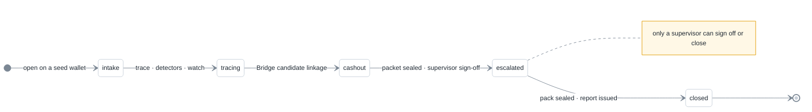

# Architecture

Companion to the README's architecture diagram. Design rationale, access model, case lifecycle and feature coverage. The project tree is in the README.

## Design choices

- **Rules, not a model.** A flag has to be explainable in a file and defensible under questioning. A rule that names its FATF category, its threshold and its evidence is auditable; a score without reasons is not. No pre-trained model is used anywhere.
- **Public explorers on free tiers.** No proprietary feed and no licence; every number is reproducible on a public explorer. Blockstream needs no key, TronGrid works without one at lower limits, Etherscan needs a free key. A paid or internal feed would be one more adapter behind the same interface.
- **Disk cache with offline replay.** Public APIs rate-limit and stall. `src/lib/cache.ts` keys responses by URL, serves them for five minutes, falls back to the stale copy when the network fails, and with `OFFRAMP_OFFLINE=1` serves only from disk so a demonstration runs with no network.
- **SQLite with an audit log.** One file through better-sqlite3 in WAL mode keeps the store simple and portable. Tables: users, sessions, cases, watch, alerts, packets, packs, audit. The schema is plain SQL behind `src/lib/db.ts`; a Postgres port would replace the driver and adapt queries, leaving the engines untouched. It has not been done.
- **Server routes only.** API keys never reach the browser; the console talks to its own API under `src/app/api`.
- **Pure engines.** Trace, detectors, risk, correlation, window and evidence are functions over typed transfers, so the same code runs on live chain data and on the labelled demonstration set.

## Access model

| Control | Implementation |
|---|---|
| Accounts | no public sign-up; a supervisor provisions, changes roles, disables and resets on the Access screen |
| Passwords | scrypt with a 16-byte random salt per user |
| Sessions | HMAC-SHA-256 signed httpOnly cookie carrying username, role, expiry (12 h) and a session id recorded in the sessions table |
| Edge check | middleware verifies signature and expiry on every non-public path; APIs answer 401, pages redirect to login |
| Server check | every API route except login and the public landing feed calls `getSession()`, which verifies the cookie again and requires the session record to be alive, so logout, *sign out everywhere*, and disabling an account stop API access immediately |
| Lockout | five failed logins lock the account for fifteen minutes; the lockout is audited |
| Roles | investigator, compliance, supervisor; only a supervisor can sign off a packet, close a case or manage accounts, enforced in the route |
| Secret | `AUTH_SECRET` signs sessions; when unset the build uses a fixed development value, which is replaced in the deployment environment |
| Audit | login, failure, lockout, password change, status change, note, watch, seal, sign-off, pack and account changes are recorded with the acting username |

## Case lifecycle



Status changes and notes are audited under the officer's login. The case timeline merges chain events, bank statement rows, packets, packs, alerts and audit rows into one ordered view, and the investigation report renders the same view as a printable document with its body hash.

## Feature coverage

| Capability | Where it lives |
|---|---|
| Multi-source collection | three block explorers, OFAC SDN, CryptoScamDB, sourced entity labels, bank statement CSV, complaints, all behind one adapter layer with a disk cache |
| Entity correlation | Bridge (wallet ↔ bank credit), Syndicates (complaints ↔ cash-out wallets), co-spend clustering on Bitcoin, sourced entity labels |
| Suspicious-transaction detection | ten detectors with evidence and transaction ids; one transparent risk score on every screen |
| Live monitoring and alerts | Live Board polling every 60 s, five alert rules, toasts and browser notifications, all audited |
| Search and investigation | search by wallet, transaction hash, account number, case id, complaint or entity; bulk screening; every lookup cached |
| Reporting and evidence | hash-chained packs, STR draft, Section 63 certificate draft, JSON bundle, investigation report with body hash, audit log |
| Access control | supervisor-provisioned accounts, scrypt, lockout, signed sessions with server-side records, route middleware, three roles |
| Extension points | a new chain is one adapter; a new list is one file under `data/`; a new detector is one function in `src/lib/detectors` |

## Project structure

```
OFFRAMP/
├── src/
│   ├── app/
│   │   ├── page.tsx                      landing · live money-flow wall
│   │   ├── login/                        sign-in
│   │   ├── (console)/                    ten authenticated scr
